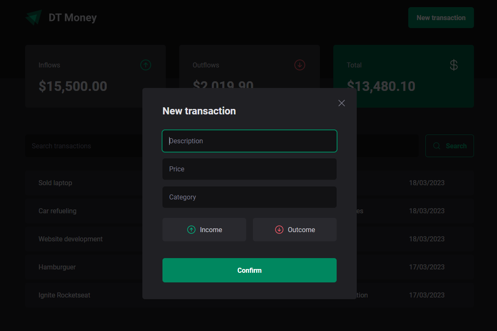

<h1 align="center">
   
  
    
  

    
    
    
  

</h1>

## ✨ Description

This app was designed to track personal transactions. 
Developed during the "Ignite - ReactJS" bootcamp by [@Rocketseat](https://www.rocketseat.com.br).

## 🚀 Technologies
-  React
    -  States, hooks, routes, props
    -  Context API
    -  Performance improvements (memo, useMemo, useCallback, useContextSelector)
-  TypeScript
-  ViteJS
-  Styled-Components
-  React Hook Form + Zod
-  Radix UI

## 💻 Installation

After cloning/downloading this repository, open your terminal, navigate to the project's directory then run:

-  `npm install` - To install packages dependencies
-  `npm run dev` - To run the application on your localhost

To simulate the API calls open a new terminal then run:

-  `npm run dev:server` - To run the fake REST API from json-server

## 🌟 Preview

